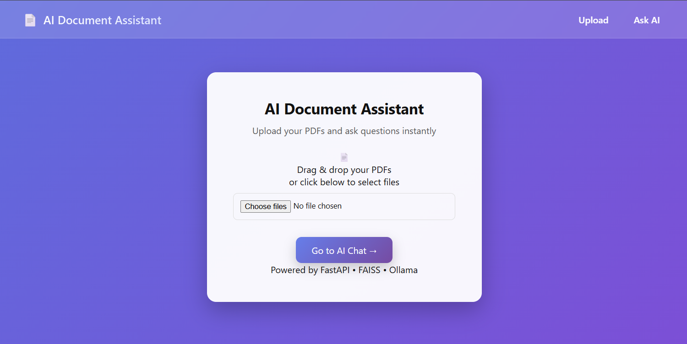
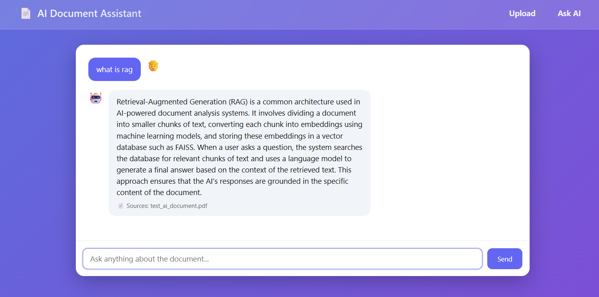

# AI Document Q&A

An AI-powered document question answering system built with **FastAPI, FAISS, SentenceTransformers, Ollama, and Next.js**.

Upload PDF documents and ask questions about them. The system retrieves relevant document context and generates accurate answers using a local language model.

---

## Features

* Upload and process multiple PDF documents
* Ask questions about document content
* Context-aware AI responses
* Source references included in answers
* Chat-style interface
* Local AI model using **Ollama (Phi3)**

---

## Screenshots

### Upload Page

### AI Chat Interface

---

## Tech Stack

### Backend

* FastAPI
* SentenceTransformers
* FAISS (Vector Database)
* Ollama (Local LLM)
* Python

### Frontend

* Next.js
* React
* TypeScript
* Custom CSS

---

## Architecture

PDF Upload
↓
Text Extraction
↓
Document Chunking
↓
Embeddings (SentenceTransformers)
↓
Vector Search (FAISS)
↓
Context Retrieval
↓
LLM Generation (Ollama Phi3)
↓
AI Answer + Sources

---

## Project Structure

ai-doc-qa
│
├── backend
│   ├── main.py
│   ├── requirements.txt
│
├── frontend
│   ├── app
│   │   ├── page.tsx
│   │   ├── ask/page.tsx
│   │   └── layout.tsx
│   ├── package.json
│
├── images
│   └── screenshots
│
└── README.md

---

## Installation

### 1. Install Ollama

Download Ollama from:

https://ollama.com

Then pull the model:

ollama pull phi3

---

### 2. Backend Setup

cd backend

python -m venv venv
venv\Scripts\activate

pip install -r requirements.txt

python -m uvicorn main:app --reload

Backend runs at:

http://127.0.0.1:8000

---

### 3. Frontend Setup

cd frontend

npm install
npm run dev

Frontend runs at:

http://localhost:3000

---

## Usage

1. Upload one or more PDF documents.
2. Navigate to **Ask AI**.
3. Ask questions related to the uploaded documents.
4. The AI retrieves relevant context and generates answers with sources.

---

## Example Questions

* Summarize this document
* What are the key points discussed?
* Explain the main topic
* What conclusions are mentioned?

---

## Future Improvements

* Streaming AI responses
* PDF viewer with highlighted answers
* Hybrid search (BM25 + Vector Search)
* Conversation memory

---

## Author

Muhammed Muflih
